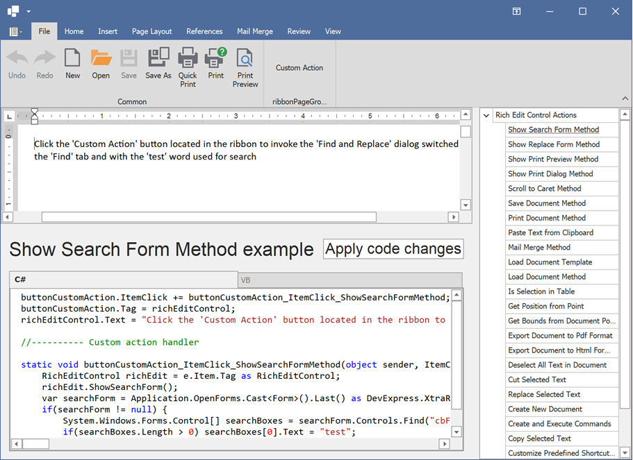

<!-- default badges list -->

<!-- default badges end -->

# WinForms Rich Text Editor - Manage the Control Behavior in Code

This example demonstrates how to use RichEditControl's API to programmatically manage the RichEditControl's behavior (commands, services).

The application includes the RichEditControl (at the bottom) used to display and edit the code and another RichEditControl (at the top) which shows the result of code execution.

Some of the RichEditControl's methods are executed by clicking the "Custom Action" button located in the RichEditControl's Ribbon menu.

## Files to Review

* [RichEditControlActions.cs](./CS/RichEditAPISample/CodeExamples/RichEditControlActions.cs) (VB: [RichEditControlActions.vb](./VB/RichEditAPISample/CodeExamples/RichEditControlActions.vb))

## More Examples

* [WinForms Rich Text Editor API – How to Process Word Documents in Code](https://github.com/DevExpress-Examples/winforms-richedit-document-api)

## Documentation

* [Visual Elements in Rich Text Editor for WinForms](https://docs.devexpress.com/WindowsForms/9548/controls-and-libraries/rich-text-editor/visual-elements)
* [Commands in Rich Text Editor](https://docs.devexpress.com/WindowsForms/9328/controls-and-libraries/rich-text-editor/commands)